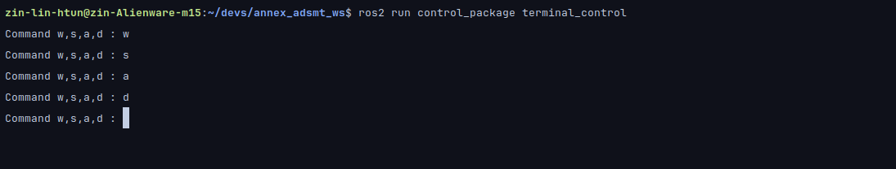
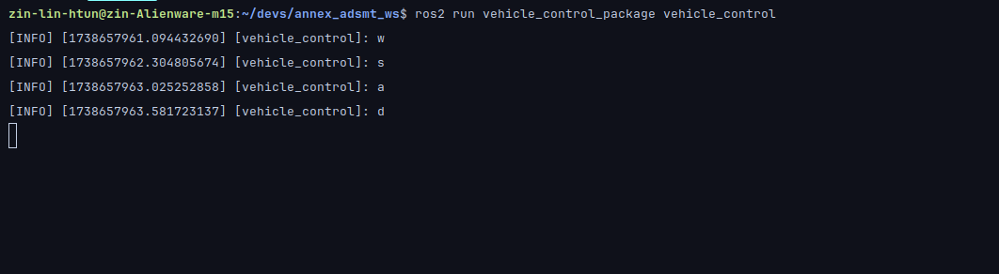

# ADS-MT Project Robotic Workspace

- This project is to demonstrate proficiency in 
	- `Python` 
	- `OOP`
	- `ROS`
	- `Modularity`
	- `Research`
    - Full research will be uploaded to `docs`
___
## System Requirements
- Linux `Ubuntu 24.+`, `Ubuntu Noble Numbnet, 24 LTS`
  - Follow docker build instructions for other platforms such as `Windows 10/11` and `WSL- Windows Subsystem Linux`
  - For `KDE neon` and `Kubuntu` follow main instructions as if `Ubuntu 24`
- `ROS2 Jazzy Jalisco`
- `Gazebo gz sim harmonic`
- `ros-jazzy-ros-gz`
---

## Hardware Requirements
- `1x` Nvidia `RTX 3050TI +` equivalent or better `dGPU` for `simulation` purposes
- `1x` Raspberry `Pi 5` `4GB` for the robotics platform [@The Pi Hut](https://thepihut.com/products/raspberry-pi-5)
- `1x` `MicroSD` card and fan for the Pi -> one may use `any` compatible
- `1x` Dynamixel `U2D2 Connector` [@Robotis](https://robotis.co.uk/robotis-u2d2.html)
- `1x` Dynamixel `U2D2 PHB` [@Robotis](https://robosavvy.co.uk/robotis-u2d2-phb-set.html)
- `16x` Dynamixel `XL-330 M288T 0.6Nm Power Servos` [@Robotis](https://robosavvy.co.uk/robotis-dynamixel-xc330-t288-t.html)
- One may use either plugs, regulators or electronics within the range of `56mmx70mm` for power option
  - This project is not to display competency in `EC engineering` but to display in `Computing` and `Engineering` aspect, as such one can work out what works for them the best in power options.
- STL files for printing are in `adsmt_description/designs-raw`
___

## Installation
### OS Installation
- Prepare PC for either dual-boot linux or other options
- Prepare Raspberry Pi 5 with `Ubuntu 24 LTS` as well, follow instructions on [Raspberry Pi Imager](https://github.com/raspberrypi/rpi-imager/releases)

### Base Software Installation
- Needs to be done on both the `PC` and `Pi` to communicate and have same `dev tools`
- Install `ROS2 Jazzy Jalisco` deb packages from Linux terminal
- 
	```shell
    locale  # check for UTF-8

    sudo apt update && sudo apt install locales
    sudo locale-gen en_US en_US.UTF-8
    sudo update-locale LC_ALL=en_US.UTF-8 LANG=en_US.UTF-8
    export LANG=en_US.UTF-8
    
    locale  # verify settings
    
    sudo apt install software-properties-common
    sudo add-apt-repository universe
    
    sudo apt update && sudo apt install curl -y
    sudo curl -sSL https://raw.githubusercontent.com/ros/rosdistro/master/ros.key -o /usr/share/keyrings/ros-archive-keyring.gpg
    
    echo "deb [arch=$(dpkg --print-architecture) signed-by=/usr/share/keyrings/ros-archive-keyring.gpg] http://packages.ros.org/ros2/ubuntu $(. /etc/os-release && echo $UBUNTU_CODENAME) main" | sudo tee /etc/apt/sources.list.d/ros2.list > /dev/null
    
    sudo apt update && sudo apt install ros-dev-tools
    sudo apt update && sudo apt upgrade
    
    sudo apt install ros-jazzy-desktop
    ```
- refer to [ROS2 Jazzy Jalisco installation](https://docs.ros.org/en/jazzy/Installation.html) for other OS Platforms
- `Gazebo Harmonic` binary version is needed, refer to [Gazebo Harmonic binary installation](https://gazebosim.org/docs/harmonic/install_ubuntu/) for standalone cases
- use gazebo harmonics ros installation  
    ```shell
    sudo apt update
    sudo apt ros-jazzy-ros-gz
    ```
---

## Building
- jazzy builds upon `colcon`
  - ```shell
    colcon build --packages-select <any-package-package-name> --symlink-install
    ```
    - Use `--symlink-install` for dealing with autonomous sourcing
  
  - For building the whole project
  ```shell
	colcon build
	```
- source
  - ```shell
    source install/local_setup.bash
    ```
  - Using `symlink` one needs to only source once, if needs rebuilding one can just run the program directly after build without the need of sourcing again.

---

## Running 
- For each package and executables
	```shell
	ros2 run <your_package_name> <your_desired_executable>
	```
- For `ADS-MT` system-wise launch for the entire Raspberry Pi assembly (Robot) to work
  - Watch out for updates
___

## Controlling
- currently terminal control is available
- make sure to run `vehicle_control_package vehicle_control` and `control_package terminal control`
	
- terminal 1 
	```shell
	ros2 run vehicle_control_package vehicle_control
	```
 
- terminal 2
	```shell
	ros2 run control_package terminal_control
	```
- use `W-S-A-D` as if a game
- one should see
	
  	
---
## Current System Stats
| Indicators | Passed            | Not Yet Capable |
|------------|-------------------|-----------------|
| Builds     | ✅                 | -               |
| Autonomous | -                 | ✅               |
| Simulation | ✅                 | -               |
| Training   | -                 | ✅               |
| Walk       | ✅*semi-functional | -               |
---

## Coming Up
- Autonomous sim performance using Sim Perception on `gz sim`
- terminal control behavioural update
- control via `flask` app
- Any relating issues should be reported on [Issue Board](https://github.com/zin-lin/annex_adsmt_ws/issues)
___

