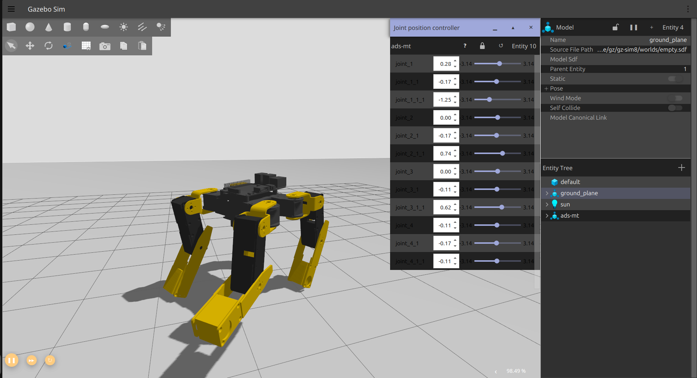

# Feb First Week Slides

- ref
  - `NXDD` - highest next day delivery `priority`  
  - `P0` - highest `priority`
  - `P1` - high `priority`
  - `P2` - low `priority`
  - `O1` - optional `priority`
---

## Recent Advancement summary
- added `URDF xacro` for the `ADS-MT`
- added `RViz` launch file 
- added `Gazebo` launch file
- added `showcase render`
- pipeline has been added
- added `documentation` folder `->` `annex_admst_ws/docs`
- added meeting history and `uml` documentation files 
- added project management on `Github`

___

## URDF, RViz and Gazebo

- URDF has been `upgraded` to `xacro` to allow better `coding` practices of materials, adjustments and `plugin`
- a new repository `adsmt_description` is added for Gazebo control 
  - this can be used in training with Gazebo
  - currently added `JointStatePublisher` , `JointPositionController`, `DepthCamera`and `Odemetry` to control and log the robot

- Gazebo training
  - for training purposes a separate `ros` package is added under `simulation/sim.py`
  - `stable-baseline3` based on `pytorch` architecture will be used 
    - though I didn't go in details about this in the literature review I surely wrote about neural-networks being used for kinematics
    - my plan is to go into details about using this in the `methodology`, which I will start writing on `Sat`
  - a new repository `perception` is also added to view and process the `DepthCamera` from gazebo.

---

## Pipeline builds
- a systematic build system has been added for local `builders` and `docker` builders both now.
- build is passing on `Git`
- set up so that `master` is protected and `build` and `containerisation` needs to passed before a `merge` request.
- also invited you to `review` and `comment` on `pull/merge` requests.
---
## Current System Stats
| Indicators    | Passed                   | Not Yet Capable |
|---------------|--------------------------|-----------------|
| Builds        | ✅                        | -               |
| Autonomous    | -                        | ✅               |
| Simulation    | ✅                        | -               |
| Training      | -                        | ✅               |
| Walk          | ✅*semi-functional        | -               |
| Sim-Walk      | ✅*semi-functional-manual | -               |
| perception    | ✅                        | -               |
| path_planning | -                        | ✅               |
| gazebo-build  | ✅                        | -               |

---
## Meeting minutes
- from now on, meeting minutes will be recorded as per `project-management`
- will use `markdown` - `.md` format as per `project-management`
- current system stats table is the `brain-child` of the minimisation fix of the `IPO`
  - will be updated weekly.
---
## Dissertation
- added `IPO` and `ITR` to the `Appendices`
- added `List of abbreviations` and cite more sources on `YOLO`, and many more on the `Appendices` as per `Kevin`'s idea.
- added more bullet points in the `Lit review`
- deleted the majority of `strong adjs` that sounds `robotic` and `AI-like`.
- any more feedback you can think of on my Lit Review as I like to finalise it and move on.
---
## Future Plan
- `P1` - look into and implement - step model from `stable-baselines`
  - if time doesn't allow, will look into open-source quadruped models and implement this with credit
    - will fine tune this to the model and I can talk a lot about engineering design and software architecture on this.

- `P2` - compare `OpenCV` and `YOLOv8` on `Depth-Camera` and propose this
  - will collect and compare `data` on `Result and Discussion`. 

- `P0` - implement `path_planning_package` both for `real-world` and `simulation`
  - I will make sure the topics are the same. 

- `P1` - methodology on `Saturday`
  - plan is to write 500-600 words a day. 
---

# Any Questions??

---
