# Feb Third+Fourth Week Slides

- ref
  - `NXDD` - highest next day delivery `priority`  
  - `P0` - highest `priority`
  - `P1` - high `priority`
  - `P2` - low `priority`
  - `O1` - optional `priority`
---

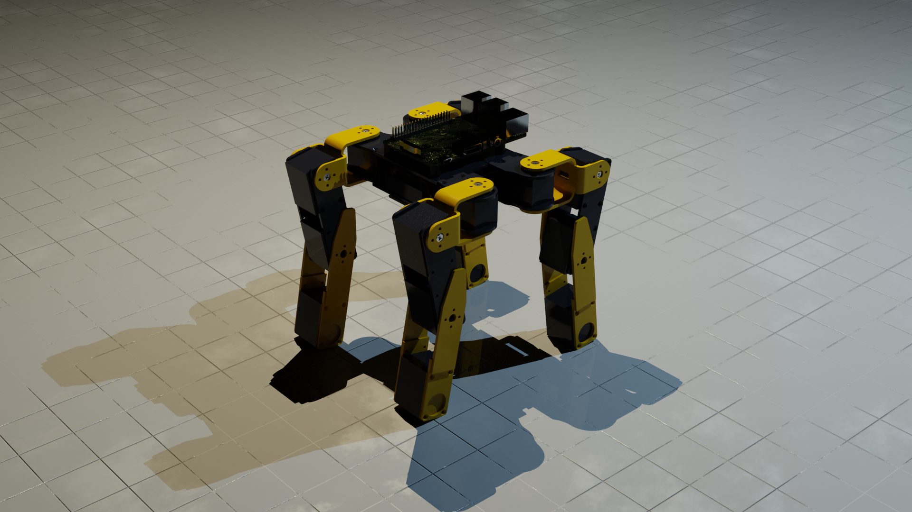

---

# Recent Advancement Summary
- added successful `amble-gait`
  - replaced one-sided forward approach with animal like amble gait
  - `leg1` + `leg4` movement and `leg2` + `leg3` movements
- added successful `documentation/test_data_logs` from `imu` data 
- added successful `documentation/test_data_logs` from `odometry` data 
  - all tested with `gazebo`
- added `documentation` on equations
- added successfully `documentation` on software architecture
- added `path_planning` module so that autonomous commands can be executed
- early stage of testing tools `empirical` research approach.
- started methodology and aiming to finish tomorrow `NXDD`. 

---

## URDF, RViz and Gazebo, Simulation Tests

- model tested for `path_planning_modes`
- added
  - `autonomous-demo`
  - `acceleration` 
  - `acceleration-walk` 
  - `walk-turn`
  - `drive-turn`
- The neural network theory is scrapped and to be implemented only if time allows for sake of narrowing the scope.
  - new priority `O1`
- testing data is collected from topics
  - `adsmt/odometry` for all missions as listed above.
  - `adsmt/imu` for all missions as listed above.
- real world demonstration has been done.

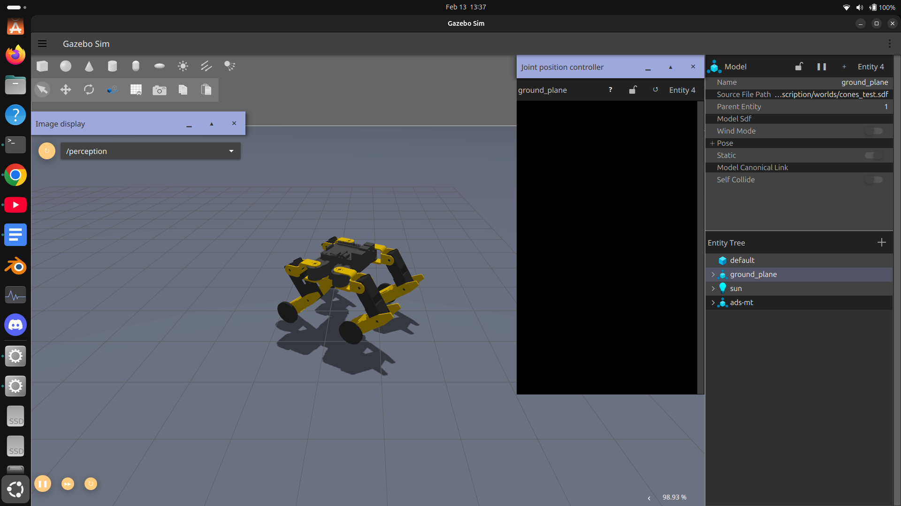 

---

## Current System Stats
| Indicators             | Passed | Not Yet Capable | Will Not be Done |
|------------------------|--------|-----------------|------------------|
| Builds                 | ✅      | -               | -                |
| Autonomous             | ✅      | -               | -                |
| Simulation             | ✅      | -               | -                |
| Training               | -      | -               | ✅                |
| Walk                   | ✅      | -               | -                |
| Sim-Walk               | ✅      | -               | -                |
| Drive-Turn             | ✅      | -               | -                |
| perception             | ✅      | -               | -                |
| path_planning          | ✅      | -               | -                |
| gazebo-build           | ✅      | -               | -                |
| software-documentation | ✅      | -               | -                |
___
## Meeting minutes
- from now on, meeting minutes will be recorded as per `project-management`
- will use `markdown` - `.md` format as per `project-management`
- current system stats table is the `brain-child` of the minimisation fix of the `IPO`
  - will be updated weekly.
---

## Dissertation - Methodology Progress
- due to testing data arrangement the methodology had not been written.
- though this is true, the sources for methodology had been searched.
- documentation of methodology sources are done. 

### Software
- `general-software` architecture

  - 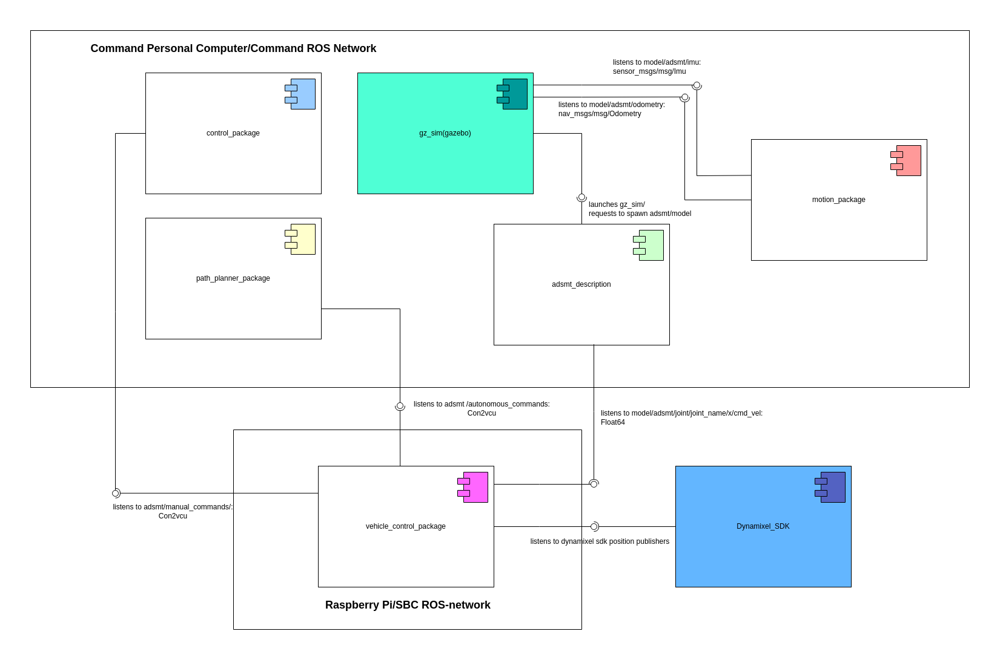
- `vehicle-control` architecture

  - 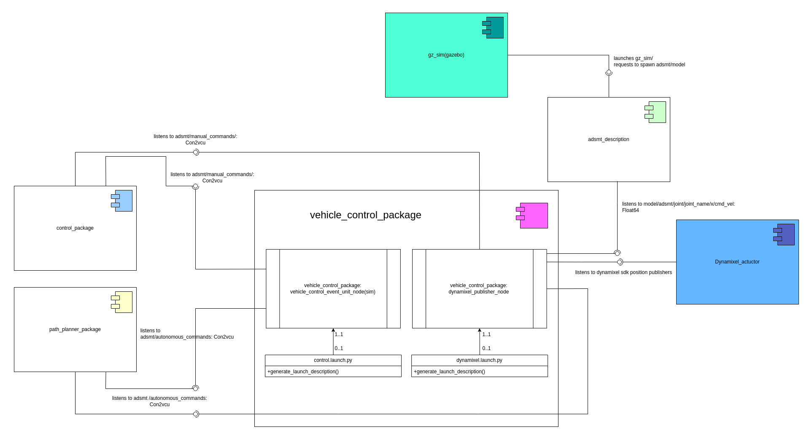
- `path-planner` architecture

  - 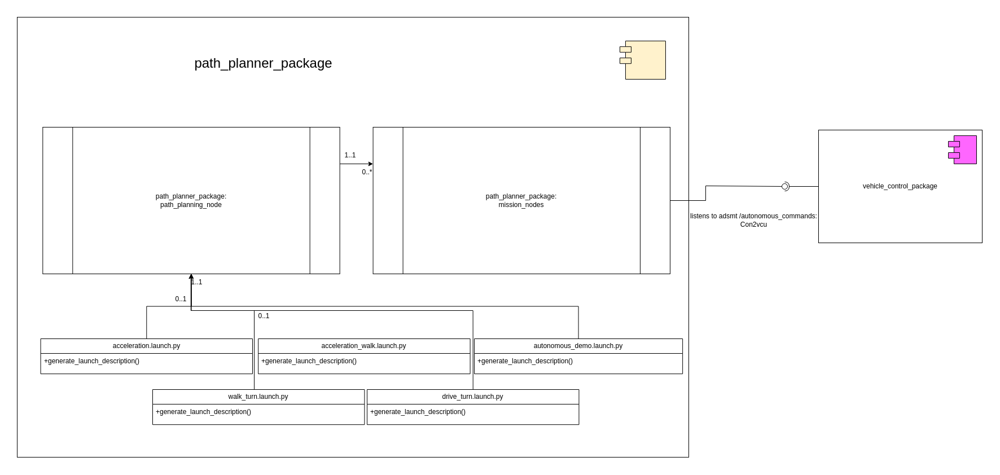
- `simulation` and `motion` model architecture

  - 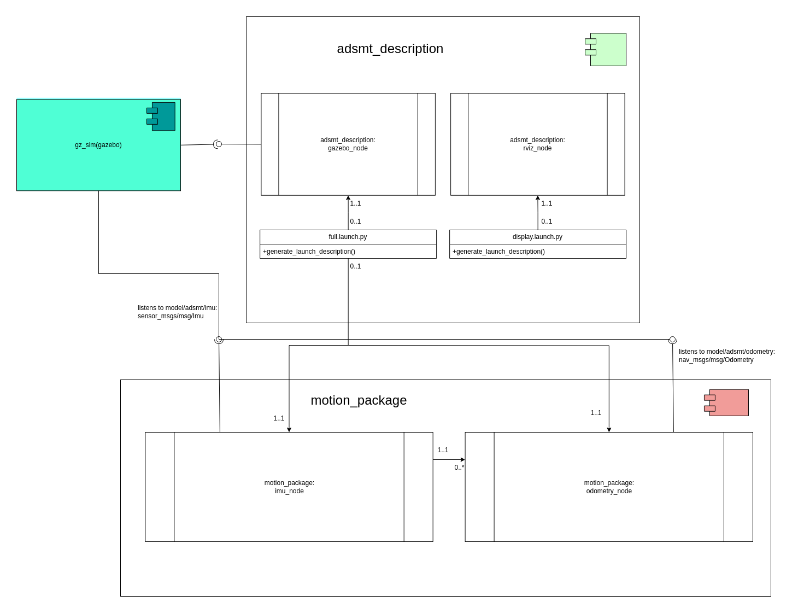

### Hardware and Circuit
- `general-hardware` architecture

    - 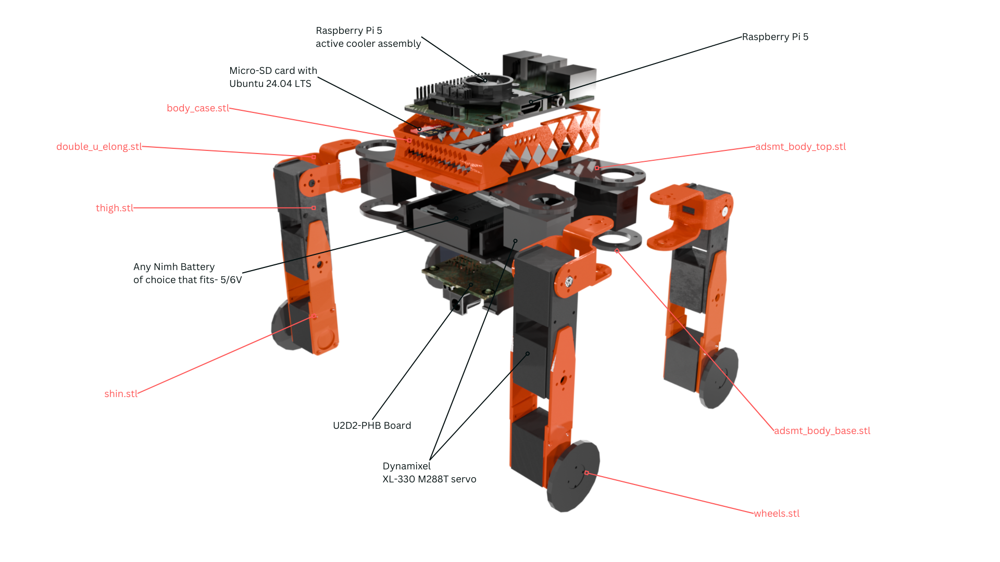

- `general-circuit` architecture
  
  - 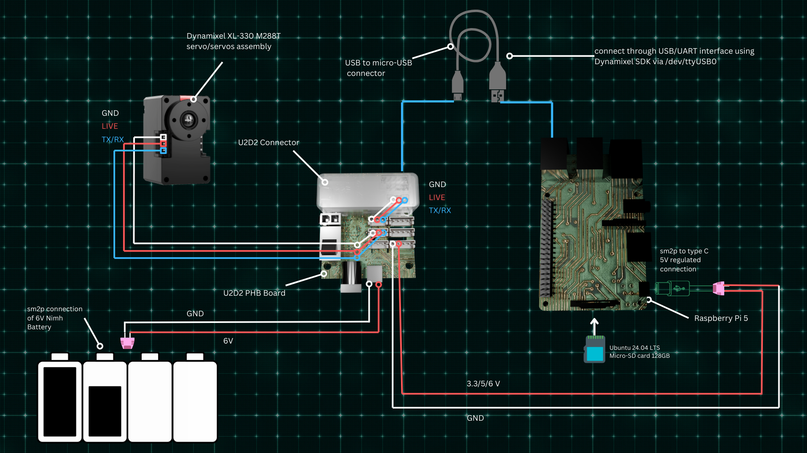 
- `servo-assembly` architecture
  - 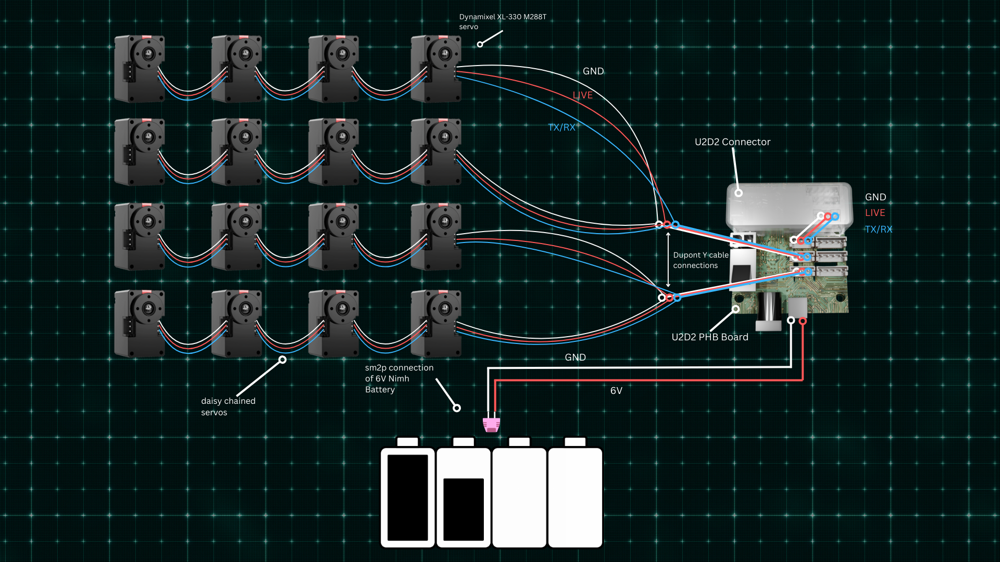

### Kinematics and Kinematics Documentation
- `walk kinematics`
  - 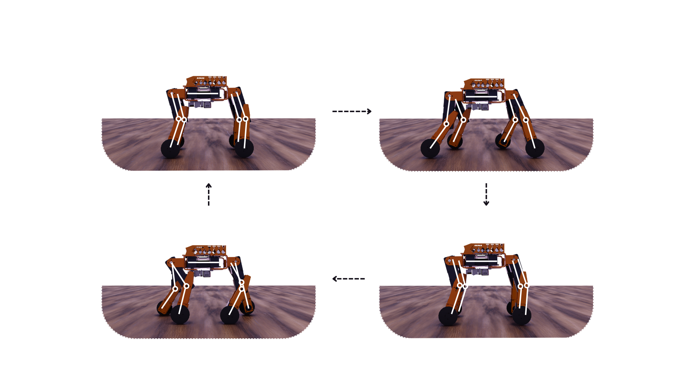
  - 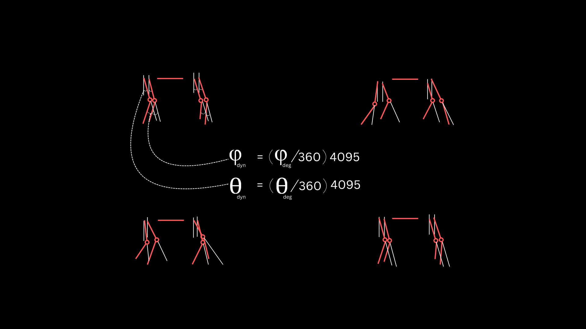
  - 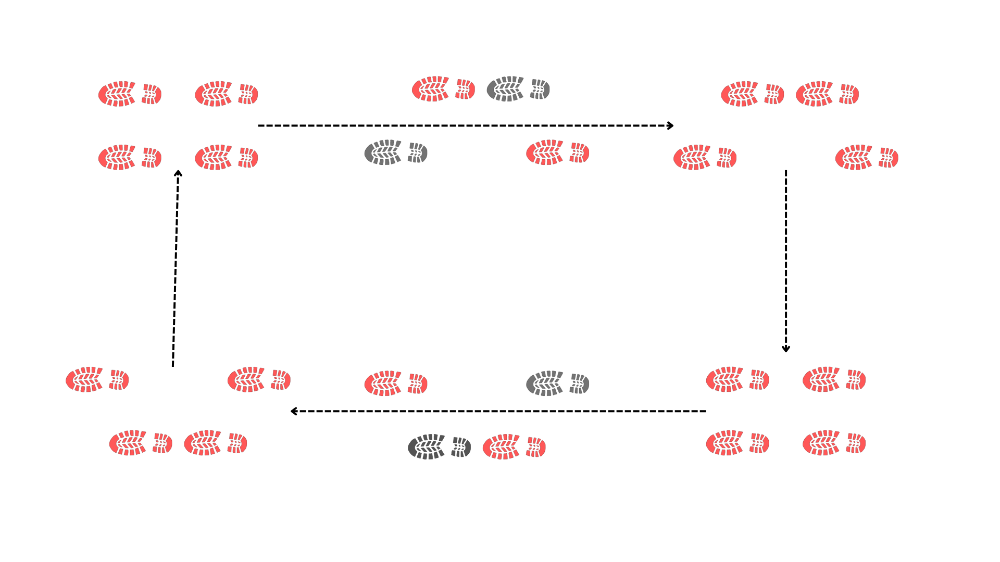
    
- `drive kinematics`
  - 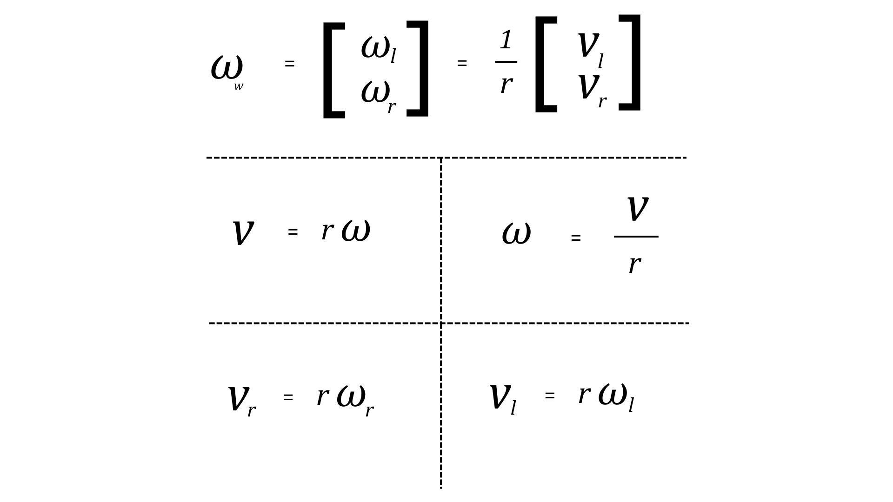
  - 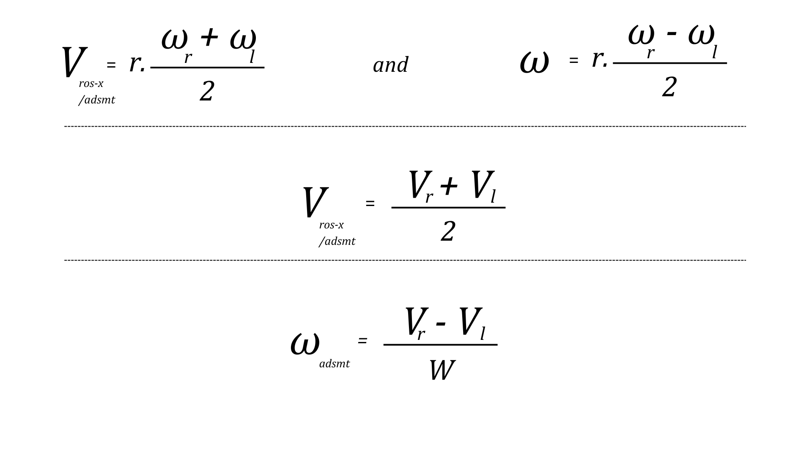
  - 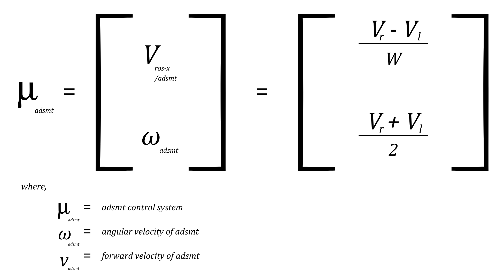

---

## Going Forward
- get `methodology` done - `NXDD`
- get results analyse - `P0`
- start working on tested data - `P1`
- start working on physical data - `P1`
- start setting up tests on `ROS2` - software communication test - `P0`
---
## Any Questions?

---

